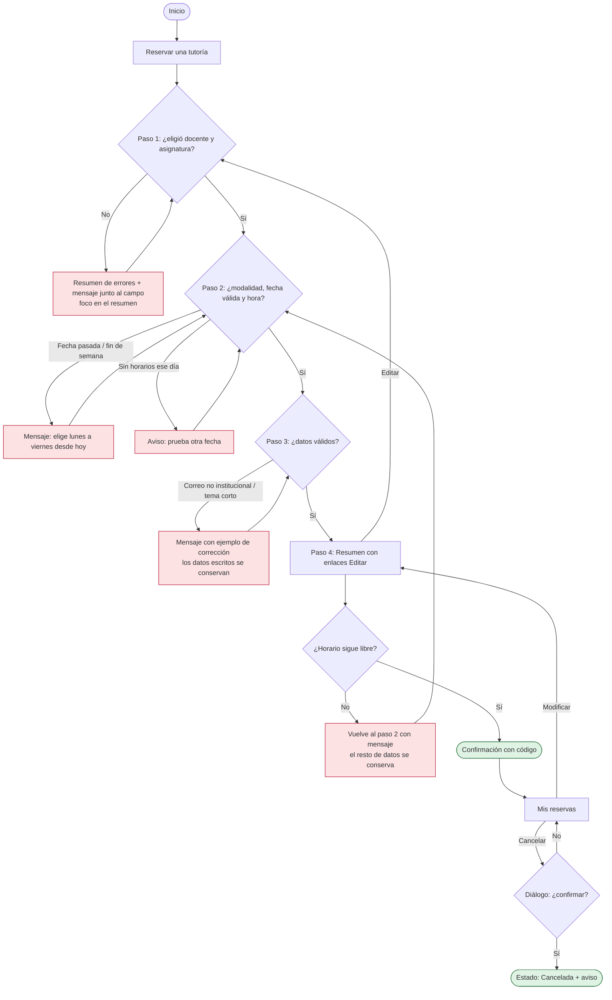

# User flow: reservar una tutoría

Camino exitoso en verde; recuperación de errores en rojo. Imagen: [diagramas/flujo.png](diagramas/flujo.png)

```mermaid
flowchart TD
  A([Inicio]) --> B[Reservar una tutoría]
  B --> C{Paso 1: ¿eligió docente y asignatura?}
  C -- No --> C1[Resumen de errores + mensaje junto al campo<br/>foco en el resumen]:::err --> C
  C -- Sí --> D{Paso 2: ¿modalidad, fecha válida y hora?}
  D -- Fecha pasada / fin de semana --> D1[Mensaje: elige lunes a viernes desde hoy]:::err --> D
  D -- Sin horarios ese día --> D2[Aviso: prueba otra fecha]:::err --> D
  D -- Sí --> E{Paso 3: ¿datos válidos?}
  E -- Correo no institucional / tema corto --> E1[Mensaje con ejemplo de corrección<br/>los datos escritos se conservan]:::err --> E
  E -- Sí --> F[Paso 4: Resumen con enlaces Editar]
  F -- Editar --> C
  F --> G{¿Horario sigue libre?}
  G -- No --> G1[Vuelve al paso 2 con mensaje<br/>el resto de datos se conserva]:::err --> D
  G -- Sí --> H([Confirmación con código]):::ok
  H --> I[Mis reservas]
  I -- Modificar --> F
  I -- Cancelar --> J{Diálogo: ¿confirmar?}
  J -- No --> I
  J -- Sí --> K([Estado: Cancelada + aviso]):::ok
  classDef err fill:#fde2e4,stroke:#b00020;
  classDef ok fill:#dff3e4,stroke:#1e6b34;
```
