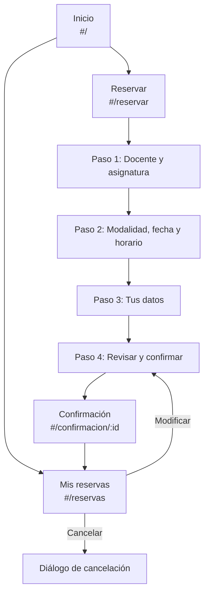

# Sitemap

```mermaid
flowchart TD
  I[Inicio<br/>#/] --> R[Reservar<br/>#/reservar]
  I --> MR[Mis reservas<br/>#/reservas]
  R --> P1[Paso 1: Docente y asignatura]
  P1 --> P2[Paso 2: Modalidad, fecha y horario]
  P2 --> P3[Paso 3: Tus datos]
  P3 --> P4[Paso 4: Revisar y confirmar]
  P4 --> CF[Confirmación<br/>#/confirmacion/:id]
  CF --> MR
  MR -->|Modificar| P4
  MR -->|Cancelar| DLG[Diálogo de cancelación]
```

Navegación global (cabecera): Inicio · Reservar · Mis reservas.
Profundidad máxima: 3 niveles. Imagen: [diagramas/sitemap.png](diagramas/sitemap.png)
